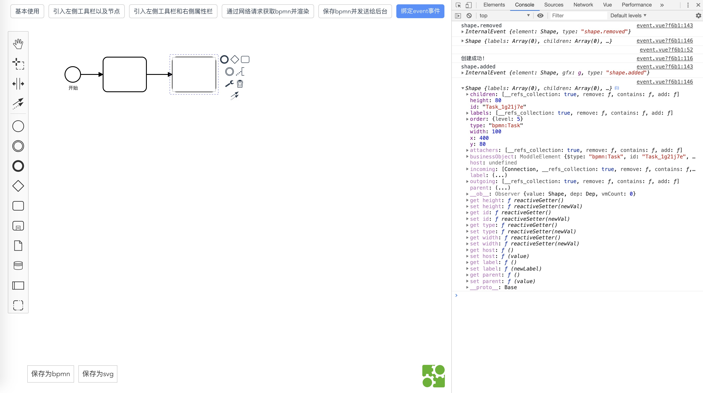

# bpmn-vue-basic

## 项目描述

此项目为以下章节中的教材案例.

- [《基础篇》](https://github.com/LinDaiDai/bpmn-chinese-document/tree/master/LinDaiDai/全网最详bpmn.js教材-基础篇.md)🔥🔥

- [《http请求篇》](https://github.com/LinDaiDai/bpmn-chinese-document/tree/master/LinDaiDai/全网最详bpmn.js教材-http请求篇.md)🔥🔥

- [《事件篇》](https://github.com/LinDaiDai/bpmn-chinese-document/tree/master/LinDaiDai/全网最详bpmn.js教材-事件篇.md)🔥🔥🔥

项目截图:




## 如何使用

将项目克隆至本地:

```
git clone git@github.com:LinDaiDai/bpmn-vue-basic.git
```

安装依赖:

```
npm install
```

本地启动项目:

```
npm run serve
```

打包发布至生成环境:

```
npm run build
```

